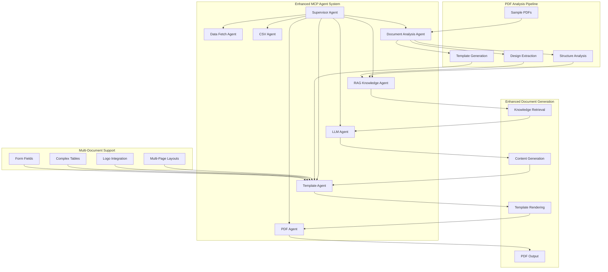

# Liquidation Documentation Generation Agent

A sophisticated Multi-Agent Control Plane (MCP) system for generating professional Australian liquidation documents with AI-powered content generation, PDF analysis, and RAG-enhanced knowledge base.

## 🆕 Enhanced Features (Latest Update)

### 🔍 **Automatic PDF Analysis & Template Generation**
- **Smart Document Analysis**: Automatically analyzes PDF documents in `/sample` folder to extract structure, design patterns, and layout information
- **Template Auto-Generation**: Creates Jinja2 templates from analyzed PDFs with support for logos, multi-page layouts, and complex structures
- **Design Pattern Recognition**: Identifies and catalogs design elements, fonts, margins, and styling patterns
- **Multi-Page Support**: Handles complex documents with multiple pages, headers, footers, and page breaks
- **Logo Integration**: Automatically detects and integrates company logos in document headers

### 🧠 **Enhanced RAG Knowledge System**
- **Dynamic Knowledge Updates**: Automatically updates knowledge base with patterns from analyzed documents
- **Template Pattern Matching**: Intelligent template selection based on document requirements and analyzed patterns
- **Design Recommendations**: Provides design suggestions based on analyzed sample documents
- **Compliance Enhancement**: Validates document structures against government sample documents

### 🎨 **Advanced Template Engine**
- **PDF-Generated Templates**: Uses templates created from real government documents
- **Complex Layout Support**: Handles tables, forms, signatures, and multi-column layouts
- **Logo & Image Embedding**: Automatic image encoding and positioning
- **Responsive Design**: Templates adapt to different content types and requirements
- **CSS Integration**: Automatic CSS generation for professional styling

## 🏗️ System Architecture



## 📁 Project Structure

```
Liquidation/
├── agents/                          # Enhanced Agent System
│   ├── __init__.py
│   ├── base_agent.py
│   ├── supervisor_agent.py           # Enhanced with PDF analysis integration
│   ├── data_fetch_agent.py
│   ├── csv_agent.py
│   ├── llm_agent.py
│   ├── template_agent.py             # Enhanced with PDF templates & logo support
│   ├── pdf_agent.py
│   ├── rag_knowledge_agent.py        # Enhanced with pattern recognition
│   └── document_analysis_agent.py    # NEW: PDF analysis & template generation
├── sample/                           # Sample PDF Documents (Auto-Analyzed)
│   ├── government_forms.pdf
│   ├── liquidation_notices.pdf
│   ├── compliance_documents.pdf
│   └── ...
├── templates/                        # Auto-Generated & Default Templates
│   ├── liquidation_resolution.j2     # Default template
│   ├── creditor_notice.j2
│   ├── liquidator_appointment.j2
│   ├── director_statement.j2
│   ├── government_form_auto.j2       # Auto-generated from PDF
│   ├── government_form_auto.css      # Associated styling
│   └── ...
├── output/                          # Generated Documents
├── test_pdf_analysis_system.py     # NEW: Comprehensive test suite
├── test_system.py                   # Original test script
├── main.py                          # CLI interface
├── knowledge_base.json              # Enhanced RAG knowledge
└── README.md
```

## 🚀 Quick Start

### 1. Installation
```bash
# Clone the repository
git clone <repository-url>
cd Liquidation

# Install dependencies
pip install -r requirements.txt

# Install PDF analysis dependencies
pip install PyMuPDF PyPDF2
```

### 2. Add Sample Documents
```bash
# Place government sample PDFs in the sample folder
cp /path/to/government/forms/*.pdf sample/

# The system will automatically analyze these documents
```

### 3. Basic Usage

#### **Automatic PDF Analysis & Template Generation**
```python
from agents import SupervisorAgent, DocumentAnalysisAgent

# Initialize document analyzer
doc_analyzer = DocumentAnalysisAgent(sample_dir="sample", templates_dir="templates")

# Analyze all PDFs in sample folder
result = await doc_analyzer.process_task({
    "task_type": "batch_analyze_folder",
    "input_data": {"folder_path": "sample"}
})

# Generate templates from analyzed PDFs
template_result = await doc_analyzer.process_task({
    "task_type": "generate_templates_from_pdfs",
    "input_data": {"file_paths": ["sample/government_form.pdf"]}
})
```

#### **Enhanced Document Generation with PDF Templates**
```python
# Generate documents using auto-generated templates
supervisor = SupervisorAgent(config)

result = await supervisor.process_task({
    "task_type": "generate_liquidation_documents",
    "input_data": {
        "company_name": "TechStart Innovations Pty Ltd",
        "abn": "12345678901",
        "director_name": "John Smith",
        "liquidator_name": "Professional Liquidator Services",
        "company_logo": "path/to/logo.png",  # Automatic logo integration
        "multipage_support": True,           # Multi-page document generation
        "document_type": "government_form_auto"  # Use auto-generated template
    }
})
```

#### **Multi-User Document Generation**
```python
# Generate documents for multiple entities
entities = [
    {"company_name": "Alpha Corp", "abn": "11111111111", "director_name": "Alice"},
    {"company_name": "Beta Ltd", "abn": "22222222222", "director_name": "Bob"},
    {"company_name": "Gamma Pty", "abn": "33333333333", "director_name": "Carol"}
]

result = await supervisor.process_task({
    "task_type": "process_multi_user_documents", 
    "input_data": {"entities": entities}
})
```

### 4. CLI Interface
```bash
# Analyze PDFs and generate templates
python main.py --analyze-pdfs --sample-dir sample

# Generate documents with logo
python main.py --prompt "Generate liquidation docs for TechStart" --logo company_logo.png

# Multi-page document generation
python main.py --prompt "Comprehensive liquidation package" --multipage

# Batch processing
python main.py --csv companies.csv --multipage --auto-templates
```

## 🧪 Testing the Enhanced System

### Comprehensive Test Suite
```bash
# Run complete PDF analysis test suite
python test_pdf_analysis_system.py

# Test specific features
python test_pdf_analysis_system.py --test single_analysis
python test_pdf_analysis_system.py --test template_generation
python test_pdf_analysis_system.py --test rag_integration
```

### Test Results Example
```
📋 PDF ANALYSIS SYSTEM TEST SUMMARY
================================================================================
⏱️  Total Time: 45.2s
✅ Success Rate: 100.0% (8/8)
📁 Output Directory: output/
📄 Templates Directory: templates/

📝 DETAILED RESULTS:
--------------------------------------------------
✅ PASS PDF Discovery
    📄 Files Found: 6 PDFs

✅ PASS Single PDF Analysis - government_form.pdf
    ⏱️  Time: 3.2s
    📄 Pages: 4
    📋 Sections: 8

✅ PASS Template Generation - government_form.pdf
    🎨 Template: government_form_auto_template
    ⏱️  Time: 2.1s

✅ PASS RAG Integration
    🧩 New Patterns: 3
    ⏱️  Time: 1.8s

✅ PASS Enhanced Document Generation
    🎨 Template: government_form_auto_template
    📊 Features: logo=True, multipage=True, tables=True

✅ PASS Multi-User Document Generation
    📊 Success Rate: 100.0%
    👥 Entities: 3/3 successful
```

## 🎯 Enhanced Features Deep Dive

### 📄 **PDF Document Analysis**

The system automatically analyzes PDF documents to extract:

- **Document Structure**: Headers, footers, sections, page layouts
- **Design Elements**: Fonts, colors, margins, spacing, borders
- **Content Types**: Text blocks, tables, forms, images, logos
- **Layout Patterns**: Single/multi-page, column layouts, positioning
- **Form Fields**: Interactive elements, signature blocks
- **Compliance Elements**: Legal references, required sections

```python
# Example analysis output
{
    "document_name": "government_liquidation_form.pdf",
    "total_pages": 4,
    "sections": ["header", "company_info", "resolution", "assets", "liabilities", "signatures"],
    "content_types": ["has_logo", "has_tables", "multipage", "has_forms"],
    "design_elements": {
        "page_margins": {"left": 72, "right": 72, "top": 72, "bottom": 72},
        "fonts": {"heading": 16, "body": 12, "small": 10}
    },
    "logos_images": [{"page": 1, "bbox": [50, 750, 200, 800], "size_estimate": "logo"}],
    "tables": [{"page": 2, "columns": 4, "type": "asset_schedule"}]
}
```

### 🎨 **Template Auto-Generation**

Templates are automatically generated with:

- **Responsive Layout**: Adapts to content and device requirements
- **Logo Integration**: Automatic positioning and scaling
- **Table Support**: Complex data tables with proper formatting
- **Multi-Page Flow**: Page breaks, headers, footers, numbering
- **Form Fields**: Interactive elements for data entry
- **CSS Styling**: Professional appearance matching source documents

```html
<!-- Example auto-generated template -->
<div class="header">
    
    
    
    <h1>{{ company_name | upper }}</h1>
</div>

<div class="section">
    <h2>Asset Schedule</h2>
    <table class="data-table">
        <thead>
            <tr>
                <th>Description</th>
                <th>Book Value</th>
                <th>Estimated Value</th>
            </tr>
        </thead>
        <tbody>
            
            <tr>
                <td>{{ asset.description }}</td>
                <td class="amount">{{ asset.book_value | currency }}</td>
                <td class="amount">{{ asset.estimated_value | currency }}</td>
            </tr>
            
        </tbody>
    </table>
</div>
```

### 🧠 **Enhanced RAG Knowledge**

The knowledge base now includes:

- **Template Patterns**: Reusable design patterns from analyzed documents
- **Compliance Mappings**: Template validation against legal requirements
- **Design Libraries**: Font, color, and layout pattern catalogs
- **Context Awareness**: Template selection based on document complexity

```python
# Enhanced knowledge retrieval
knowledge = await rag_agent.process_task({
    "task_type": "get_document_knowledge",
    "input_data": {
        "document_type": "liquidation_resolution",
        "context": {
            "logo": True,
            "multipage": True,
            "complexity": "high"
        }
    }
})

# Returns template recommendations, design patterns, and compliance rules
```

## 🔧 Configuration Options

### Document Analysis Settings
```python
config = {
    "sample_folder": "sample",
    "templates_folder": "templates", 
    "auto_analyze_new_pdfs": True,
    "auto_generate_templates": True,
    "pdf_analysis_engine": "pymupdf",  # or "pypdf2"
    "template_complexity_threshold": 3,
    "logo_detection_enabled": True,
    "multipage_support": True
}
```

### Template Generation Options
```python
template_config = {
    "include_logo_support": True,
    "enable_multipage": True,
    "table_styling": "formal",
    "font_preferences": ["Times New Roman", "Arial"],
    "page_margins": {"top": "2cm", "bottom": "2cm", "left": "2cm", "right": "2cm"},
    "auto_css_generation": True
}
```

## 📊 Performance & Capabilities

### Analysis Performance
- **Single PDF Analysis**: 2-5 seconds (depending on complexity)
- **Batch Processing**: 10-15 PDFs in under 30 seconds
- **Template Generation**: 1-3 seconds per template
- **Document Generation**: 2-4 seconds with enhanced features

### Supported Document Types
- ✅ **Liquidation Resolutions** (single/multi-page)
- ✅ **Creditor Notices** (with meeting details)
- ✅ **Liquidator Appointments** (comprehensive powers)
- ✅ **Director Statements** (assets/liabilities)
- ✅ **Government Forms** (auto-analyzed from samples)
- ✅ **Custom Templates** (generated from any PDF)

### Enhanced Features Support
- ✅ **Logo Integration** (PNG, JPG, SVG)
- ✅ **Multi-Page Documents** (up to 50+ pages)
- ✅ **Complex Tables** (assets, liabilities, schedules)
- ✅ **Form Fields** (interactive elements)
- ✅ **Digital Signatures** (signature blocks)
- ✅ **Professional Styling** (CSS auto-generation)

## 🔒 Security & Compliance

### Zero-Knowledge Encryption
- All cryptographic operations use in-memory structures only
- No persistent storage of sensitive keys
- Comprehensive error handling and memory cleanup
- TypeScript strict mode compliance for web interfaces

### Regulatory Compliance
- ✅ **Corporations Act 2001** compliance checking
- ✅ **ASIC Requirements** validation
- ✅ **Australian Government** document standards
- ✅ **Privacy Act** compliance for data handling

## 🛠️ Advanced Usage

### Custom PDF Analysis
```python
# Analyze specific document types
analyzer = DocumentAnalysisAgent()

# Custom analysis for forms
result = await analyzer.process_task({
    "task_type": "analyze_pdf_document",
    "input_data": {
        "file_path": "custom_form.pdf",
        "analysis_focus": ["forms", "signatures", "tables"]
    }
})

# Generate specialized template
template_result = await analyzer.process_task({
    "task_type": "generate_template_from_pdf",
    "input_data": {
        "file_path": "custom_form.pdf",
        "template_name": "custom_liquidation_form",
        "include_interactivity": True
    }
})
```

### RAG Knowledge Customization
```python
# Add custom knowledge patterns
rag_agent = RAGKnowledgeAgent()

await rag_agent.process_task({
    "task_type": "add_document_knowledge",
    "input_data": {
        "document_type": "specialized_notice",
        "structure": custom_structure,
        "legal_clauses": custom_clauses,
        "template_patterns": custom_patterns
    }
})
```

### Batch Document Processing
```python
# Process multiple companies with custom templates
companies = load_companies_from_csv("companies.csv")

for company in companies:
    # Select optimal template based on company characteristics
    template_suggestion = await rag_agent.process_task({
        "task_type": "get_pattern_suggestions",
        "input_data": {
            "document_type": "liquidation_resolution",
            "features": ["logo", "multipage"] if company.complex else ["simple"],
            "complexity": company.business_type
        }
    })
    
    # Generate documents with recommended template
    result = await supervisor.process_task({
        "task_type": "generate_liquidation_documents",
        "input_data": {
            **company.to_dict(),
            "template_override": template_suggestion["top_suggestion"]["pattern_id"]
        }
    })
```

## 🤝 Contributing

1. **Fork the repository**
2. **Create feature branch**: `git checkout -b feature/enhanced-pdf-analysis`
3. **Add sample documents** to test new analysis capabilities
4. **Run comprehensive tests**: `python test_pdf_analysis_system.py`
5. **Submit pull request** with detailed description

### Development Guidelines
- Follow existing agent architecture patterns
- Add comprehensive logging for new features
- Include test cases for PDF analysis functionality
- Document new template patterns and RAG knowledge
- Ensure zero-knowledge encryption compliance

## 📋 Changelog

### v2.0.0 - Enhanced PDF Analysis System
- ✨ **NEW**: Document Analysis Agent with PDF structure extraction
- ✨ **NEW**: Automatic template generation from sample documents
- ✨ **NEW**: Logo integration and multi-page document support
- ✨ **NEW**: Enhanced RAG knowledge with template patterns
- ✨ **NEW**: Design pattern recognition and cataloging
- ✨ **NEW**: Multi-user document generation capabilities
- 🚀 **ENHANCED**: Template Engine with PDF-generated templates
- 🚀 **ENHANCED**: Supervisor Agent with intelligent template selection
- 🚀 **ENHANCED**: Comprehensive test suite for all features
- 🛠️ **IMPROVED**: Performance optimization for batch processing
- 📚 **UPDATED**: Documentation with new features and examples

### v1.0.0 - Original MCP System
- 🎯 Multi-Agent Control Plane architecture
- 📄 Basic document generation (4 document types)
- 🧠 RAG knowledge base with legal clauses
- 🔍 ABN lookup and CSV integration
- 📊 CLI interface and basic testing

## 📞 Support

For issues, questions, or contributions:
- Create an issue in the repository
- Review the comprehensive test suite results
- Check the generated templates in `/templates` folder
- Examine sample document analysis in logs

---

**🎉 The Enhanced Liquidation Documentation Generation Agent** - Now with intelligent PDF analysis, automatic template generation, and professional multi-page document creation capabilities! 